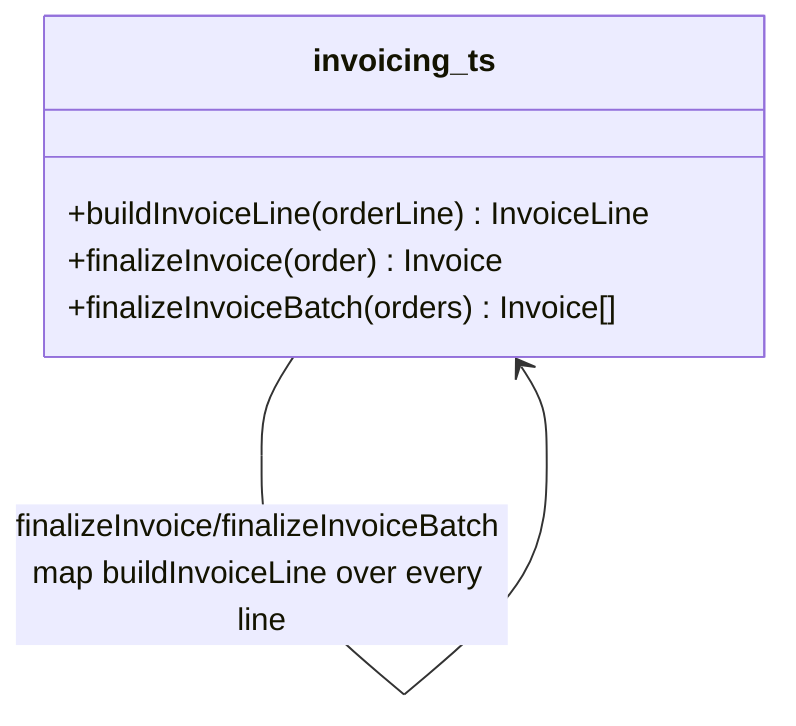

# Walkthrough — Ravensgate invoice and surcharge engine

Read this **after** you have your own version.

---

## The structure

No book diagram to map this against either - `buildInvoiceLine` is a plain function, and the
question worth sitting with is which of three unrelated decisions this route bet was worth
pulling into one place:

**On the mapping.** Same answer as
[`solutions/notification-routing`](../notification-routing/WALKTHROUGH.md) gives for its own
axis: this is Fowler's *Extract Function*, not a named GoF pattern - there's nothing here shaped
enough like a class hierarchy to call Factory Method or Strategy honestly, even though "build a
different representation depending on a kind" is the same family of problem Factory Method
answers at a larger scale.

**On the name.** `buildInvoiceLine`, not `makeLine` or `getLineTotal`. Question 1 from
[`docs/NAMING.md`](../../../../../docs/NAMING.md) - `buildInvoiceLine(orderLine)` reads at the
call site as "the invoice line for this order line," which is exactly what both callers need
back from it.

---

## Why this route bet on the construction axis

This route's bet: **how a line is built, by kind, is the decision most worth insulating**,
because product is the team most likely to add a new line kind or change an existing one's
rule (a new bundle tier, a new kind of fee) without warning. A reasonable bet - whoever owns
the catalog would have applauded it.

---

## Why act 2 doesn't reward it

The low-value-review rule is entirely a notification change: a new threshold on totalCents that
adds a channel, with no effect on how any line is built and no effect on how surcharges stack.
This route never touched the notification branching, so it still duplicates the new clause
across `finalizeInvoice` and `finalizeInvoiceBatch` - the same shape `src/` is in, and the same
cost. See [ACT2.md](./ACT2.md) for the numbers.

---

## What it cost, and what it didn't win

- **In act 1, this route costs about the same as
  [`solutions/notification-routing`](../notification-routing/WALKTHROUGH.md)** - one function,
  two call sites, a reasonable, defensible restructuring of a real pressure.
- **It just wasn't the pressure this particular act 2 tested.** [ACT2.md](./ACT2.md) shows this
  route tying the no-pattern baseline exactly - 7 lines, 3 hunks - because the axis it
  insulated was never the one that needed to change.
- This is the honest lesson of the exercise: picking which pressure to relieve first is a bet
  about what changes next, and act 1 alone can't tell you which bet pays off.
