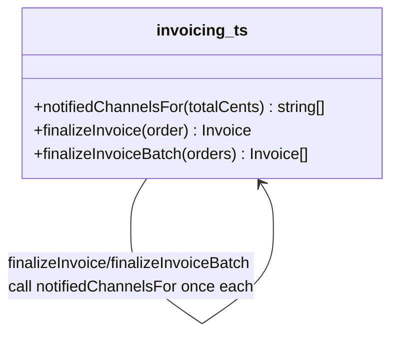

# Walkthrough — Ravensgate invoice and surcharge engine

Read this **after** you have your own version.

---

## The structure

No book diagram to map this against - `notifiedChannelsFor` is a plain function, not a class
hierarchy, and the point of this route isn't to name a pattern, it's to notice which of three
unrelated decisions was worth pulling into one place:

**On the mapping.** There isn't one, deliberately: this exercise doesn't name a target, and the
honest answer here is "extract the function that varies along the axis I'm betting will change
again" - closer to Fowler's *Extract Function* than to any single GoF pattern. If which channels
fire grew enough independent behaviour per channel (not just a threshold, but real per-channel
delivery logic - retries, formats, opt-outs), an `Observer`-shaped answer - one small listener
per channel - would have been the next honest step past this. It didn't need to get there yet.

**On the name.** `notifiedChannelsFor`, not `getChannels` or `computeNotifications`. Question 1
from [`docs/NAMING.md`](../../../../../docs/NAMING.md) - `notifiedChannelsFor(totalCents)`
reads at the call site as "the channels notified for this total," which is exactly what both
callers ask it for.

---

## Why this route bet on the notification axis

Three decisions sat in `src/`, none announced as more likely to change than the others, and
none the same *kind* of decision as the others - construction, a varying rate, and fan-out.
This route's bet: **which channels hear about an invoice is the decision most likely to gain a
new threshold or a new channel**, because notification rules are policy - compliance, ops and
finance all have their own reasons to add a new consumer without warning. Line construction and
surcharges, by contrast, are closer to the physical shape of an order: a bundle discount or a
remote-area fee don't change just because a new stakeholder wants to be notified.

---

## What it cost, and what it won

- **In act 1, this route touches slightly more than doing nothing** - one function, two call
  sites. Cheap, but not free.
- **See [ACT2.md](./ACT2.md) for the payoff**: the low-value-review rule lands on exactly the
  axis this route restructured, and costs 4 lines across 2 hunks - the cheapest of the three
  measured routes, including the no-pattern baseline.
- Compare [`solutions/line-construction`](../line-construction/WALKTHROUGH.md), which made the
  opposite bet and ties the baseline's cost for this particular change - not because that bet
  was unreasonable, but because it wasn't the axis this act 2 happened to test.
