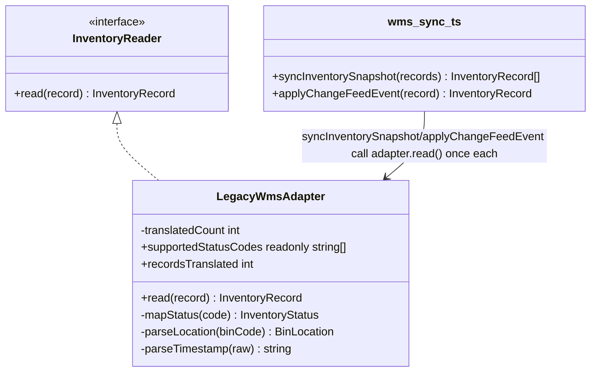

# Walkthrough — Ravensgate legacy WMS integration

Read this **after** you have your own version.

---

## The structure

This is the one solution route in the whole repository that maps onto an actual GoF diagram -
`InventoryRecord` is the target shape, `LegacyWmsRecord` is the adaptee, `LegacyWmsAdapter` is
the adapter:

**On the mapping.** This one earns the name honestly: `LegacyWmsAdapter` sits behind
`InventoryReader`, translating the legacy shape into the one the app wants, exactly the GoF
motivation. [`docs/TYPESCRIPT.md`](../../../../../docs/TYPESCRIPT.md)'s Adapter row even names
the condition under which the classic class form is worth it in TypeScript: "when the adapter
holds state or must be swapped at runtime." This one holds state - `translatedCount`, read
through `recordsTranslated` for the nightly job's completion log and the change-feed listener's
health check - so building it as a class wasn't an unreasonable reflex.

**On the name.** `LegacyWmsAdapter`, `InventoryReader`, `read` - not `LegacyWmsHelper` or
`convert`. Question 1 from [`docs/NAMING.md`](../../../../../docs/NAMING.md): the names say what
the GoF roles actually are, which is exactly the point of naming a pattern when you use one.

---

## Why this route bet on the class

Two real reasons, not a strawman: the state (`translatedCount`) that TYPESCRIPT.md's own rule
asks for, and an interface that lets a caller check `supportedStatusCodes` before calling
`read()` instead of relying on a thrown error - a defensible bit of defensive programming at a
boundary this brittle. Both are genuine engineering judgment calls a reasonable reviewer would
have signed off on.

---

## Why act 2 doesn't reward it

The state that justified the class has nothing to do with the axis act 2 touched. Status
translation still had to grow, and it had to grow in **two** places this route created for
itself: the `supportedStatusCodes` list (so the capability check stays honest) and the
`mapStatus` switch (so `read()` actually handles the new code) - plus the interface's target
type, same as every route pays. The plain function in
[`solutions/translation-function`](../translation-function/WALKTHROUGH.md) never split those
two facts apart in the first place, so it never has to keep them in sync. See
[ACT2.md](./ACT2.md) for the numbers.

---

## What it cost, and what it didn't win

- **In act 1, this route costs a little more than
  [`solutions/translation-function`](../translation-function/WALKTHROUGH.md)** - an interface,
  a class, a capability list, a counter - each individually defensible, together more surface
  than this boundary turned out to need.
- **Act 2 makes the bet's price concrete**: [ACT2.md](./ACT2.md) shows this route still beating
  the no-pattern baseline - restructuring wasn't wasted - but costing more than
  [`solutions/translation-function`](../translation-function/WALKTHROUGH.md) on every dimension
  the budget checks: 8 lines and 4 hunks against 6 and 3. The gap is the interface's own
  bookkeeping, not the class itself.
- This is the repository's own admission, stated as plainly as the rest of it: reaching for
  Adapter because a legacy integration *looks* like the textbook example is not the same as
  measuring whether this one, specifically, needed it. It didn't pay off as well as the plainer
  answer - not because Adapter is a bad pattern, but because the one thing that would have made
  its full ceremony pay for itself (a second implementation ever needing to swap in) was never
  going to happen here.
