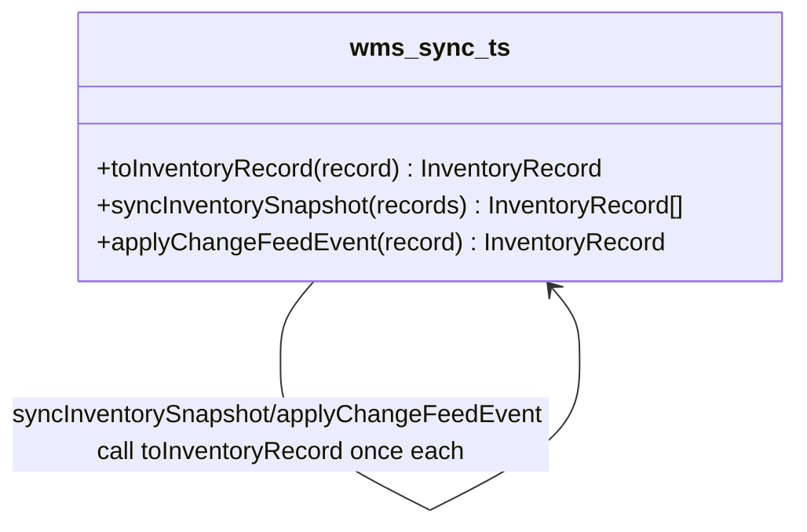

# Walkthrough — Ravensgate legacy WMS integration

Read this **after** you have your own version.

---

## The structure

No book diagram to map this against - `toInventoryRecord` is a plain function, and the point
of this route is that nothing here needed to be more than that:

**On the mapping.** There isn't one, deliberately. This is Fowler's *Extract Function*, not a
named GoF pattern - and [`docs/TYPESCRIPT.md`](../../../../../docs/TYPESCRIPT.md)'s own Adapter
row says as much: "structural typing: no `implements`, an object literal is enough" is the
TypeScript-flavoured version of Adapter, and a function is the degenerate, simplest case of
that - there's no second shape here to adapt *to*, so there's nothing for an object literal or
a class to add.

**On the name.** `toInventoryRecord`, not `translate` or `convert`. Question 1 from
[`docs/NAMING.md`](../../../../../docs/NAMING.md) - `toInventoryRecord(record)` reads at the
call site as "the inventory record for this legacy record," which is exactly what both callers
need back from it.

---

## Why this route bet on the function

TYPESCRIPT.md's own rule for when Adapter's classic form earns its keep again: "when the
adapter holds state or must be swapped at runtime." Neither is true here. There is exactly one
legacy WMS, no second one ever arriving to swap in, and nothing about translating one record
needs to remember anything between calls. A function was not a shortcut around Adapter - it was
the correctly-sized answer to what this boundary actually needed.

---

## Why act 2 rewards it

The pending-inspection rule is entirely a translation change - a new status code, a new
quantity rule tied to it - and translation is the one thing this route already pulled into a
single place. One new `else if` branch and one changed line, both inside the same function
every caller already shares. See [ACT2.md](./ACT2.md) for the numbers.

---

## What it cost, and what it won

- **In act 1, this route costs less than [`solutions/legacy-adapter`](../legacy-adapter/WALKTHROUGH.md)** -
  one function instead of an interface, a class, and the extra surface a class-shaped answer
  invites even when it isn't required.
- **Act 2 confirms it wasn't a coincidence**: [ACT2.md](./ACT2.md) shows this route beating
  both the no-pattern baseline and the Adapter route, on every dimension the budget checks.
- The honest reason isn't "classes are bad" - it's that this boundary never had the property
  (a second implementation worth swapping in) that would have made the class's extra structure
  pay for itself, on this change or any other one this kata's two acts can show you.
